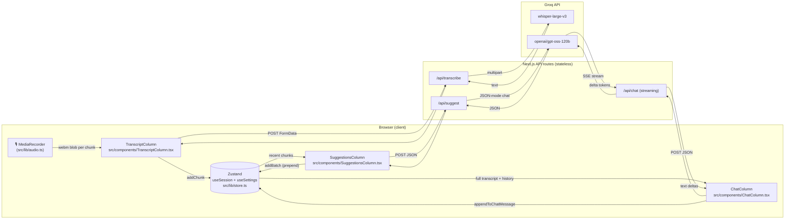
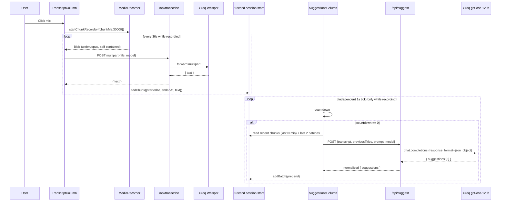
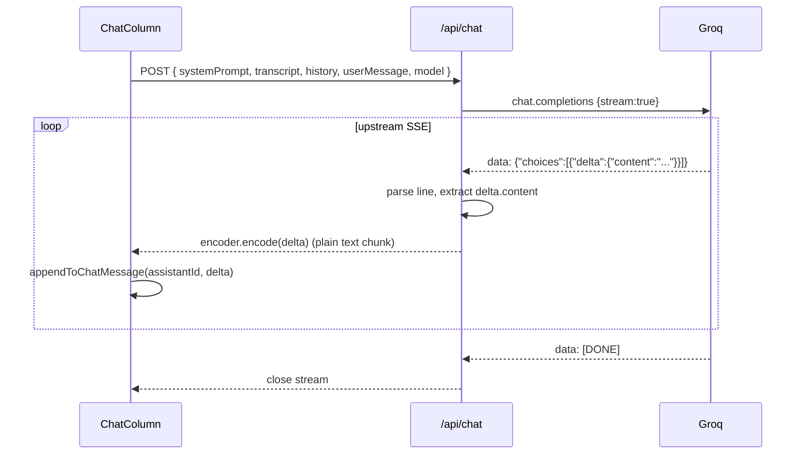
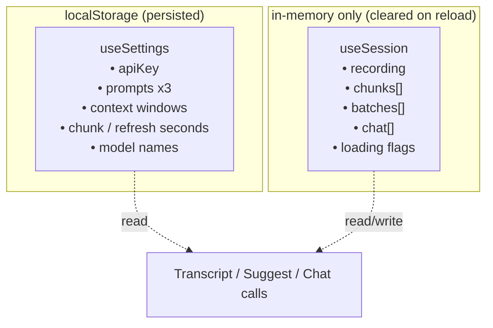
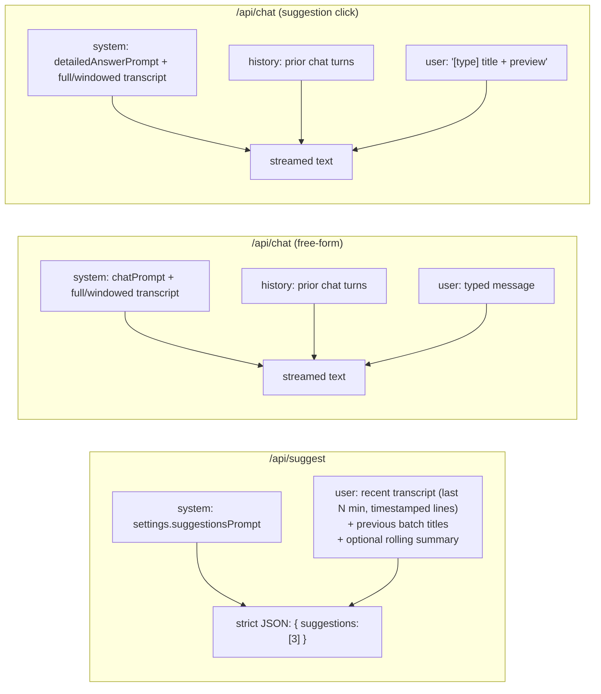

# TwinMind — Design

How the app works once you click the mic and a live conversation starts. This doc explains the data flow, the streaming path, the storage model, and where each piece lives in the repo.

TL;DR — **there is no database and no server-side cache.** The transcript is the source of truth and lives in a small in-memory client store (Zustand). API routes are stateless proxies to Groq. The 30-second suggestion cadence is a client-driven interval that re-reads the current transcript and makes a fresh stateless call.

---

## 1. High-level architecture



**Why this shape**

- Client owns session state — aligns with the spec ("no persistence on reload") and keeps the server stateless so it scales trivially.
- API routes proxy Groq rather than letting the browser call Groq directly. This keeps the API key out of CORS and lets us post-process (JSON validation, SSE → text) server-side.
- Every 30-second suggestion request is independent. No "job", no "session id" — just the current transcript window plus recent titles to avoid repetition.

---

## 2. Component map

| Layer | File | Responsibility |
|---|---|---|
| **Audio capture** | `app/src/lib/audio.ts` | Starts `MediaRecorder`, cycles start/stop every `chunkMs`, emits one self-contained webm/opus `Blob` per chunk. |
| **Transcript column** | `app/src/components/TranscriptColumn.tsx` | Owns the mic button + recording state. Uploads each blob to `/api/transcribe`. Appends the returned text to the store. Auto-scrolls on new chunks. |
| **Suggestions column** | `app/src/components/SuggestionsColumn.tsx` | Countdown timer (`autoRefreshSeconds`). On refresh, slices the transcript to the last `suggestionsContextMinutes`, POSTs to `/api/suggest`, prepends the returned batch. Also supports manual reload. |
| **Chat column** | `app/src/components/ChatColumn.tsx` | Two code paths: (a) free-form user input uses `chatPrompt`, (b) suggestion-click uses `detailedAnswerPrompt` + wider context. Both stream tokens into a growing assistant message. |
| **Settings dialog** | `app/src/components/SettingsDialog.tsx` | Edits API key, models, prompts, and context windows. Persists to `localStorage` via `zustand/middleware/persist`. |
| **UI primitives** | `app/src/components/ui.tsx` | `Panel`, `Button`, `TypeChip`, `StatusDot` — shared look. |
| **State** | `app/src/lib/store.ts` | Two stores: `useSettings` (persisted) and `useSession` (in-memory only). |
| **Prompts** | `app/src/lib/prompts.ts` | All three default prompts. Editable at runtime. |
| **Groq wrappers** | `app/src/lib/groq.ts` | Thin `fetch` helpers for `/chat/completions` and `/audio/transcriptions`. Reads the per-request `x-groq-key` header. |
| **Export** | `app/src/lib/export.ts` | Builds the session JSON with ISO timestamps. |
| **API — transcribe** | `app/src/app/api/transcribe/route.ts` | Forwards multipart to Groq Whisper. Short-circuits on silent chunks. |
| **API — suggest** | `app/src/app/api/suggest/route.ts` | Builds the structured user prompt (recent transcript + previous titles), calls Groq in JSON mode, validates/trims/clamps the 3 suggestions. |
| **API — chat** | `app/src/app/api/chat/route.ts` | Calls Groq with `stream: true`, parses upstream SSE, emits **plain-text** token deltas to the browser (simpler client). |

---

## 3. Lifecycle during a live meeting



**Two independent loops.** The audio loop and the suggestion loop don't know about each other — they only share the Zustand `chunks` array. That decoupling is what makes "refresh every 30s" trivial: the suggestion code just reads whatever transcript happens to be in the store at that moment.

---

## 4. Streaming data handling

There are **two** kinds of "streaming" in the app. They're different mechanisms.

### 4a. Audio → transcript is not truly streaming — it's chunked

`MediaRecorder` can emit progressively via `timeslice`, but those mid-stream fragments aren't individually decodable by Whisper. So we use a **stop/restart cycle** instead: each 30s we stop the recorder (flushing a full, valid webm container), kick off a new recorder, and upload the finished blob in parallel.

```mermaid
sequenceDiagram
  participant A as audio.ts
  participant MR as MediaRecorder #n
  A->>MR: new MediaRecorder(stream); start()
  Note over MR: recording...
  A->>MR: stop() after chunkMs
  MR-->>A: ondataavailable + onstop (parts[])
  A->>A: new Blob(parts, webm/opus)
  A-->>TC: onChunk(blob, startedAt, endedAt)
  A->>MR: (immediately) new MediaRecorder(stream); start()
```

Implementation: `app/src/lib/audio.ts` — function `startChunkRecorder`, which re-`cycle`s on each `onstop`. Multiple uploads can be in flight at once; order of insertion into the store follows server response order but each chunk carries its own `startedAt` so the UI renders them in time order.

### 4b. Chat is true token streaming (SSE → text)

The chat endpoint calls Groq with `stream: true` and re-emits **just the text deltas** as a plain `text/plain` body so the client doesn't have to parse SSE.



Client code is just a `ReadableStream` reader + `TextDecoder` + `store.appendToChatMessage(id, delta)`. Every delta triggers a Zustand update → React re-renders the assistant bubble. See `app/src/app/api/chat/route.ts` and `app/src/components/ChatColumn.tsx`.

Why re-emit plain text instead of forwarding SSE? Fewer moving parts on the client (no EventSource, no SSE parser, no custom framing). Server already has to read the stream to check for errors, so unwrapping there is essentially free.

---

## 5. Storage model — no cache, no DB

Nothing is persisted server-side. Everything lives in the browser, split across two stores:



**Settings** use `zustand/middleware/persist` under the key `twinmind.settings.v1`. Only settings persist. This is what you want — the API key shouldn't be re-entered on every reload, but meeting content shouldn't leak across sessions.

**Session** is a plain Zustand store. It holds three arrays (`chunks`, `batches`, `chat`) and a couple of flags. It does not persist; reloading the page wipes it, which matches the spec.

### Why no cache is needed for the 30s toggle

The "run suggestions every 30s" pattern looks like it would benefit from caching, but it doesn't, because:

1. **Each call is a pure function of `(recent chunks, last 2 batch titles, prompt)`.** No session id, no conversation id, no mutable server state. If we cached anything we'd be caching an input that already lives on the client.
2. **The input changes every cycle** — new chunks keep arriving. Caching per-interval results would return stale suggestions.
3. **Dedup / anti-repeat is already handled** by passing `previousTitles` into the prompt. That is the only cross-request state the model needs, and it is derived from `useSession.batches`.
4. **Groq has its own prompt-caching** on the backend for repeated system prompts; we don't need to reinvent it.

If the app grew to multi-device or resumable sessions, the minimal addition would be a single table (e.g. Postgres / Redis) keyed by `sessionId`, storing the three arrays. That's it. The API routes would become thin reads/writes around that table. No other architectural change.

### Concurrency notes

- **Transcribe** requests can overlap (a chunk that's still uploading while the next 30s chunk starts). They commute — each one just does an `addChunk`. Order in the UI follows `startedAt`, not arrival order, so late chunks still display correctly.
- **Suggest** requests are guarded by a `loadingSuggestions` flag so we never fire two at once; the countdown simply skips that tick if one is in flight.
- **Chat** streaming is guarded by `chatStreaming`; the input is disabled mid-stream.

---

## 6. Where the 30s cadence actually lives

One interval, one place: the countdown `useEffect` in `app/src/components/SuggestionsColumn.tsx`. Pseudocode:

```ts
useEffect(() => {
  if (!recording) return;
  const id = setInterval(() => {
    setCountdown((c) => {
      if (c <= 1) { void refresh(); return settings.autoRefreshSeconds; }
      return c - 1;
    });
  }, 1000);
  return () => clearInterval(id);
}, [recording, settings.autoRefreshSeconds]);
```

- Runs only while `recording` is true. Stopping the mic pauses the loop automatically.
- Reading `settings.autoRefreshSeconds` means the user can change the cadence in Settings and it takes effect on the next tick.
- The manual "Reload suggestions" button calls the same `refresh()` function and resets the countdown — one code path, no drift between manual and auto refresh.

---

## 7. Prompt inputs per request (what we actually send)



The single `/api/chat` endpoint handles both typed-chat and detailed-answer paths; the caller decides which system prompt and which transcript window to pass. That's why there's no separate `/api/detail` route — it would only differ in two parameters.

---

## 8. Failure modes and what happens

| Failure | Where handled | Behavior |
|---|---|---|
| No API key | All three columns check | Red inline banner; no network call fired. |
| Mic permission denied | `TranscriptColumn.start()` catch | Error banner, recording state stays off. |
| Silent chunk (<2 KB) | `/api/transcribe` | Returns `{ text: "" }`; no `addChunk`. |
| Whisper non-2xx | `/api/transcribe` | JSON error surfaced as red banner in the transcript column. |
| Model returns non-JSON suggestions | `/api/suggest` | 502 with the raw text; UI shows the error; next 30s tick retries. |
| Stream breaks mid-answer | `ChatColumn` reader catch | Whatever was received stays visible; error banner; user can retry. |
| User edits prompt mid-meeting | `useSettings` | Next `/api/suggest` or `/api/chat` call uses the new prompt instantly. No restart needed. |

---

## 9. What would change with a real backend

For the assignment this is deliberately overkill, but the natural path if you wanted multi-device / resumable sessions:

- Add `sessionId` (uuid) created on first mic click.
- `/api/transcribe` → also `INSERT` the chunk into Postgres keyed by `sessionId`.
- `/api/suggest` → also `INSERT` each batch.
- `/api/chat` → append to a messages table; stream as-is.
- `GET /api/session/:id` rehydrates Zustand on load.

No change to prompts, to the streaming path, or to the 30s loop. The client would just read from the server instead of from memory. That's the benefit of keeping the current design stateless: the jump is a purely additive change.
